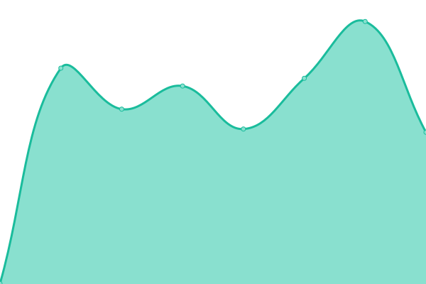
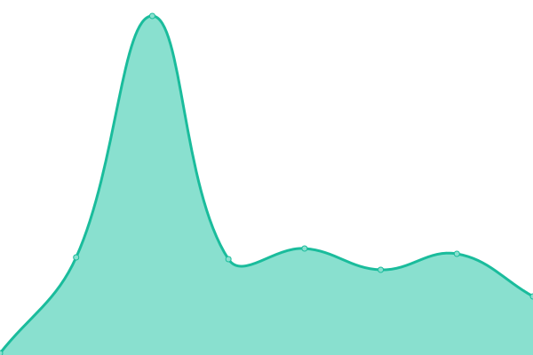
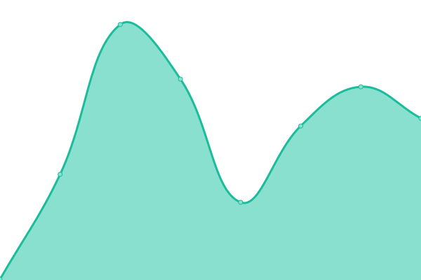

# [📈 Live Status](https://status.lksg.me): <!--live status--> **🟩 All systems operational**

This repository contains the open-source uptime monitor and status page for [Linkspring](https://lksg.me), powered by [Upptime](https://github.com/upptime/upptime).

With [Upptime](https://upptime.js.org), you can get your own unlimited and free uptime monitor and status page, powered entirely by a GitHub repository. We use [Issues](https://github.com/Linkspring/upptime/issues) as incident reports, [Actions](https://github.com/Linkspring/upptime/actions) as uptime monitors, and [Pages](https://status.lksg.me) for the status page.

<!--start: status pages-->
<!-- This summary is generated by Upptime (https://github.com/upptime/upptime) -->
<!-- Do not edit this manually, your changes will be overwritten -->
<!-- prettier-ignore -->
| URL | Status | History | Response Time | Uptime |
| --- | ------ | ------- | ------------- | ------ |
|  [Linkspring App](https://lksg.me) | 🟩 Up | [linkspring-app.yml](https://github.com/Linkspring/upptime/commits/HEAD/history/linkspring-app.yml) | 

 2795ms
     
 | 

<a href="https://status.lksg.me/history/linkspring-app">100.00%</a>
    

|  [Linkspring CDN](https://cdn.lksg.me/static/cache_manifest.json) | 🟩 Up | [linkspring-cdn.yml](https://github.com/Linkspring/upptime/commits/HEAD/history/linkspring-cdn.yml) | 

 255ms
     
 | 

<a href="https://status.lksg.me/history/linkspring-cdn">100.00%</a>
    

|  [Freshdesk](https://linkspring.freshdesk.com/) | 🟩 Up | [freshdesk.yml](https://github.com/Linkspring/upptime/commits/HEAD/history/freshdesk.yml) | 

 273ms
     
 | 

<a href="https://status.lksg.me/history/freshdesk">100.00%</a>
    

<!--end: status pages-->
